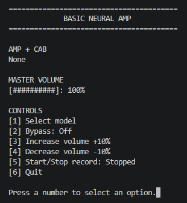
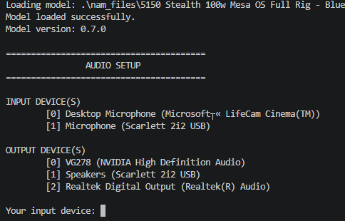

# Basic Neural Amp

Basic Neural Amp is a real-time guitar amplifier application written in C++. It loads Neural Amp Modeler (`.nam`) profiles through the bundled NeuralAudio library, captures audio from a selected input device, processes it through the model, and sends the result to a selected output device.

The application provides a small console interface for bypassing the model and adjusting the master volume.



## System Requirements

- Windows 10 or later.
- A C++20-compatible compiler.
- CMake 3.12 or later.
- Visual Studio 2022 with the Desktop development with C++ workload.
- An available audio input device, such as a guitar interface.
- An available audio output device, such as headphones or speakers.
- A compatible Neural Amp Modeler `.nam` model file. You can find a wide selection of models on [Tone3000](https://www.tone3000.com/).

The project includes its required third-party source code in `third_party/`, including [NeuralAudio](https://github.com/mikeoliphant/NeuralAudio) and [miniaudio](https://miniaud.io/). No separate dependency download is required after cloning the repository.

## Build

Clone the repository and configure a Visual Studio build. Adapt the argument according to your version of Visual Studio:

```powershell
git clone --recurse-submodules https://github.com/cardenware/basic-neural-amp.git
cd basic-neural-amp
cmake -S . -B build -G "Visual Studio 17 2022" -A x64
```

Build the Debug configuration:

```powershell
cmake --build build --config=debug
```

For a Release build:

```powershell
cmake --build build --config=release
```

The executable is created at one of these locations:

- `build/Debug/BasicNeuralAmp.exe`
- `build/Release/BasicNeuralAmp.exe`

## Run

Pass a `.nam` model with the required `--nam-file` option. For example:

```powershell
.\build\Debug\BasicNeuralAmp.exe --nam-file ".\nam_files\5150 Stealth 100w Mesa OS Full Rig - Blue, Red and Green\5150 Stealth 100w Red Mesa OS - jp_is_out_of_tune.nam"
```

At startup, the application lists available input and output devices. Enter the index of the device to use for each prompt.



Use headphones or a suitable audio interface to reduce the risk of feedback when monitoring the processed signal.
