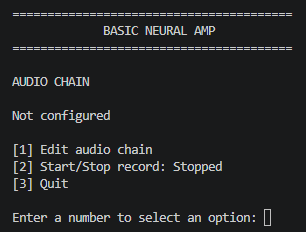
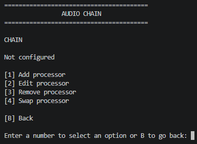
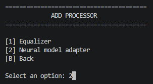
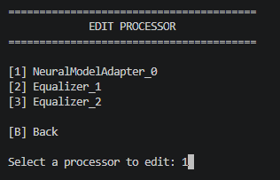
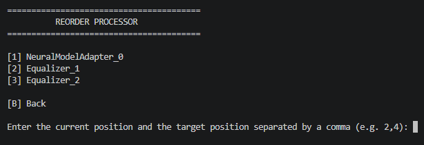
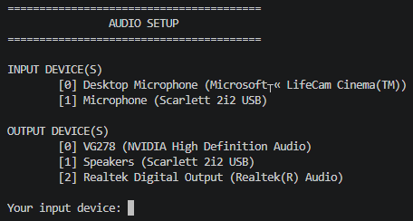

# Basic Neural Amp

Basic Neural Amp is a real-time guitar amplifier application built in C++. It loads Neural Amp Modeler (`.nam`) profiles through the bundled NeuralAudio library, captures audio from a selected input device, processes it through the model, and sends the result to a selected output device.

The app includes a lightweight console interface for selecting a model, bypassing the neural processing, and adjusting the master output level.



## Features

- Lightweight and real-time audio processing with a Neural Amp Modeler profile
- Input and output device selection at startup
- In-app model browsing and selection
- Audio chain configuration
- No external dependency download required for bundled third-party code

## System Requirements

- Windows 10 or later
- CMake 3.12 or later
- Visual Studio 2022 with the Desktop development with C++ workload
- An available audio input device, such as a guitar interface (configured at 48 kHz)
- An available audio output device, such as headphones or speakers
- A compatible Neural Amp Modeler `.nam` file. A wide selection is available on [Tone3000](https://www.tone3000.com/)

The project includes its required third-party source code in `third_party/`, including [NeuralAudio](https://github.com/mikeoliphant/NeuralAudio) and [miniaudio](https://miniaud.io/). No separate dependency download is required after cloning the repository.

## Build

Clone the repository and configure a Visual Studio build. Adjust the generator if you are using a different Visual Studio version:

```powershell
git clone --recurse-submodules https://github.com/cardenware/basic-neural-amp.git
cd basic-neural-amp
cmake -S . -B build -G "Visual Studio 17 2022" -A x64
```

Build the Debug configuration:

```powershell
cmake --build build --config=debug
```

For a Release build:

```powershell
cmake --build build --config=release
```

The executable is created at one of these locations:

- `build/Debug/BasicNeuralAmp.exe`
- `build/Release/BasicNeuralAmp.exe`

## Run

Start the application from a command prompt:

```powershell
.\build\Debug\BasicNeuralAmp.exe
```

From the main menu, you can also open the audio chain editor, where you can add, edit, remove, or reorder processors in the signal chain.



The add-processor screen looks for available `.nam` files inside the `nam_files` folder, so you can quickly build or swap the active model chain.



Once a processor is added, you can edit its settings, remove it from the chain, or reorder it to change the processing order.





At startup, the application lists available input and output devices. Enter the index for the device you want to use in each prompt.



> Use headphones or a suitable audio interface to reduce the risk of feedback when monitoring the processed signal.

*Recorded audio clip is a `.wav` file saved in the project root directory.*